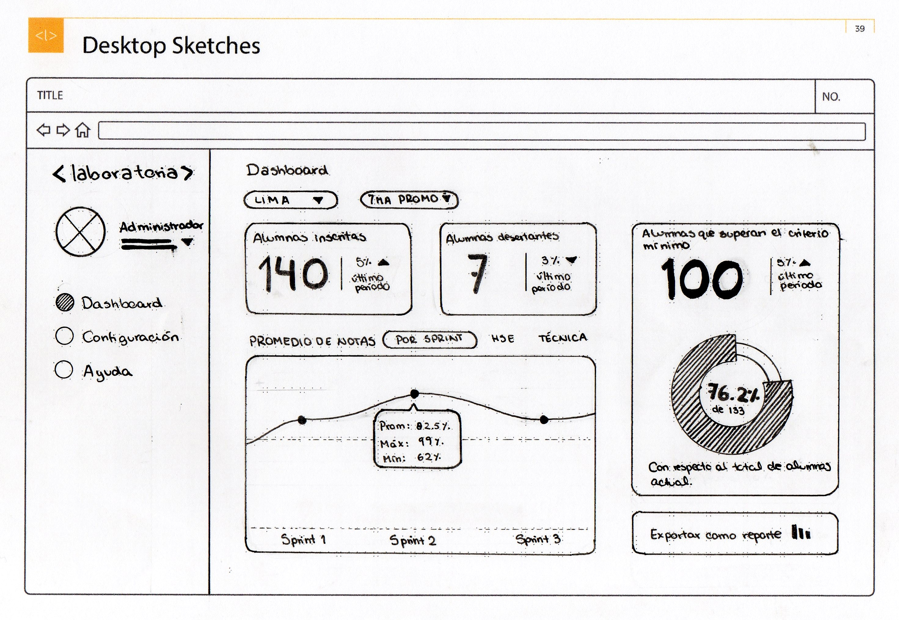

# Laboratoria Dashboard

Fase inicial del desarrollo de un data dashboard para Laboratoria.  En el dashboard, los usuarios mencionados pueden ver rápidamente estadísticas y datos en tiempo real como:

* Número de alumnas inscritas
* Número de alumnas que desertaron
* Número y % de alumnas que pasan el criterio mínimo de evaluación
* Promedio de notas por sprint
* Promedio de notas HSE
* Promedio de notas técnicas

Sketching manual

Versión digital de baja fidelidad